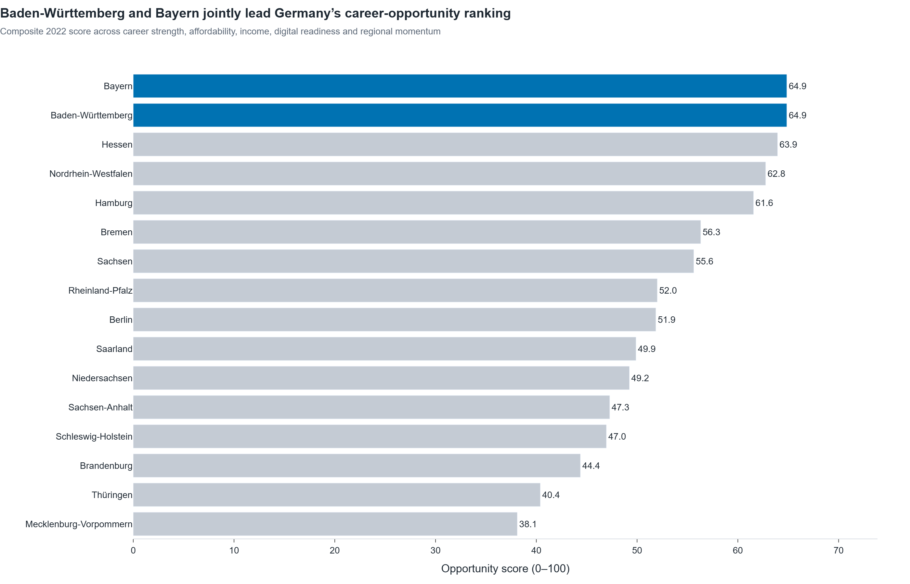
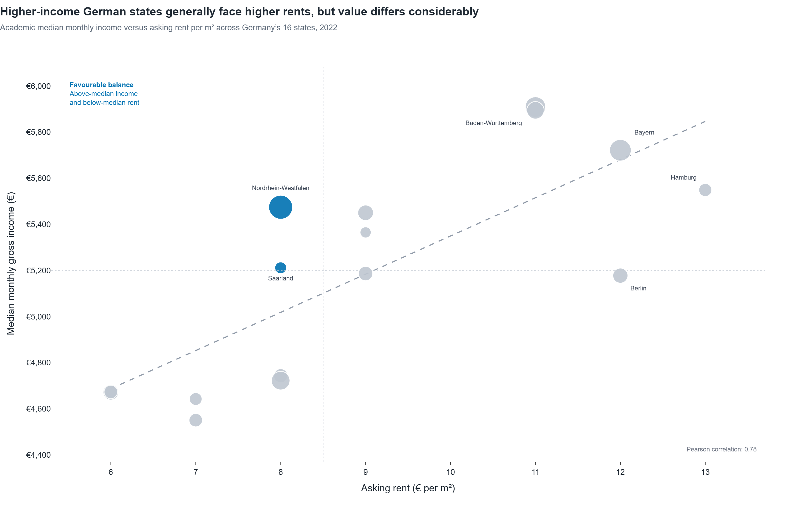
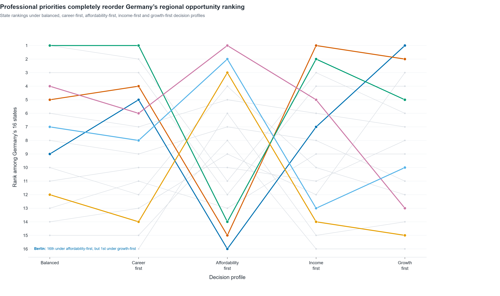

# DataCareer Germany

## Where should data professionals live and work in Germany?

DataCareer Germany is an exploratory data analysis and decision-support project that compares Germany’s 16 federal states across career opportunities, income, housing affordability, labour-market strength, digital infrastructure and regional growth.

The project goes beyond ranking states by salary alone. It examines the trade-offs professionals face when choosing where to build a career, such as higher income versus higher rent, established labour markets versus emerging regions, and current opportunity versus future growth.

---

## Project Objectives

The project answers the following questions:

1. Which German states provide the strongest overall career opportunity?
2. Do states with higher academic incomes also have higher rents?
3. Which states offer the strongest income-to-rent balance?
4. Which states combine low unemployment with strong specialist employment?
5. Which states improved both population and employment between 2017 and 2022?
6. Is broadband infrastructure associated with IT and science employment?
7. How do productivity rankings change after housing costs are considered?
8. Which states are established career hubs and which are emerging challengers?
9. How does Berlin compare with other major German career centres?
10. How do rankings change when users prioritise career strength, affordability, income or growth?

---

## Key Findings

- **Baden-Württemberg and Bavaria jointly lead** the balanced regional opportunity ranking.
- Higher academic income is strongly associated with higher asking rent, with a correlation of approximately **0.78**.
- **Saxony, Saxony-Anhalt and North Rhine-Westphalia** provide some of the strongest income-to-rent balances.
- **Hamburg** ranks first in GDP per capita but falls to last place in the illustrative affordability ranking.
- **Berlin** ranks first when regional growth is prioritised but last when affordability receives the greatest weight.
- Broadband availability and specialist employment have a positive correlation of approximately **0.75**.
- There is no universally best state. The preferred location changes substantially according to the professional’s priorities.

---

## Overall Opportunity Model

The balanced opportunity score uses five category scores:

| Category | Weight |
|---|---:|
| Career strength | 35% |
| Affordability | 25% |
| Income and economic performance | 20% |
| Digital readiness | 10% |
| Regional momentum | 10% |

Each indicator is converted into a percentile score across Germany’s 16 states.

For indicators such as employment, income and broadband availability, higher values receive stronger scores. For unemployment, rent and rent burden, lower values receive stronger scores.

The model is designed as a transparent decision-support framework rather than a definitive measure of quality of life.

---

## Data

### Primary source

The project uses data from **INKAR 2025**, published by the German Federal Institute for Research on Building, Urban Affairs and Spatial Development.

The analysis includes 12 indicators:

| Indicator | Purpose |
|---|---|
| Population | Regional size and visual context |
| Unemployment rate | Labour-market stability |
| Employment rate | Labour-market participation |
| Expert-level employment | Depth of highly qualified employment |
| IT and science-service employment | Specialist career-market strength |
| Knowledge-intensive industry | Advanced industrial structure |
| Median income for academic qualifications | Income potential |
| Asking rent | Housing affordability |
| GDP per capita | Regional economic productivity |
| 100 Mbit/s broadband availability | Digital infrastructure |
| Ten-year population change | Long-term regional momentum |
| Migration balance | Regional attractiveness and growth |

### Analytical period

The main regional comparison uses a complete **2022 snapshot**, because it is the latest year for which all selected indicators are available across all 16 states.

Time-based analyses use the available historical observations without interpolation.

---

## Important Methodological Notes

The dataset does not contain salaries specifically for data professionals. Median monthly income for employees with academic qualifications is therefore used as a broad income proxy.

Housing affordability is estimated using the asking rent for an illustrative **50 m² apartment**:

```text
Estimated monthly rent = asking rent per m² × 50
```

The illustrative rent burden is calculated as:

```text
Estimated monthly rent ÷ median gross academic income × 100
```

This is a standardised regional comparison. It is not an estimate of actual disposable income because it does not include taxes, utilities, household composition, city-level differences or individual rental contracts.

Correlations shown in the project describe associations and do not establish causality.

---

## Visualisations

All visualisations are built with Plotly and exported as interactive HTML files and high-resolution PNG images.

### Overall regional opportunity



### Income versus asking rent



### Rankings under different professional priorities



The complete visualisation collection is available in [`assets/figures`](assets/figures).

| No. | Visualisation |
|---:|---|
| 1 | Overall opportunity ranking |
| 2 | Academic income versus asking rent |
| 3 | Salary-to-rent opportunity |
| 4 | Career-market strength quadrant |
| 5 | Population and employment progress |
| 6 | Broadband versus specialist employment |
| 7 | Productivity versus affordability ranking |
| 8 | Established hubs versus emerging challengers |
| 9 | Berlin peer profile |
| 10 | Priority-scenario ranking changes |

---

## Project Structure

```text
datacareer-germany/
├── assets/
│   └── figures/
│       ├── 01_overall_opportunity_ranking.html
│       ├── 01_overall_opportunity_ranking.png
│       └── ...
├── data/
│   ├── processed/
│   │   ├── germany_state_snapshot_2022.csv
│   │   └── metric_dictionary.csv
│   └── raw/
├── notebooks/
│   └── datacareer_germany_analysis.ipynb
├── presentation/
├── src/
├── tests/
├── .gitignore
├── requirements.txt
└── README.md
```

Large raw source files, virtual environments, Parquet files and local database files are excluded from version control.

---

## Technology Stack

- Python
- Pandas
- NumPy
- Plotly
- JupyterLab
- DuckDB
- PyArrow
- Kaleido
- Streamlit
- Git and GitHub

---

## Running the Project Locally

### 1. Clone the repository

```bash
git clone <repository-url>
cd datacareer-germany
```

### 2. Create a virtual environment

On Windows PowerShell:

```powershell
python -m venv .venv
.venv\Scripts\Activate.ps1
```

### 3. Install the dependencies

```powershell
pip install -r requirements.txt
```

### 4. Start JupyterLab

```powershell
jupyter lab
```

Open:

```text
notebooks/datacareer_germany_analysis.ipynb
```

Run the notebook from top to bottom using the project virtual-environment kernel.

---

## Processed Dataset

The repository contains a compact processed dataset for reproducibility:

```text
data/processed/germany_state_snapshot_2022.csv
```

It contains one row for each of Germany’s 16 federal states and includes the indicators required for the main analysis.

The indicator definitions are stored in:

```text
data/processed/metric_dictionary.csv
```

The original multi-gigabyte INKAR source file is not included in the repository.

---

## Scenario Analysis

The project evaluates five decision profiles:

| Profile | Main priority |
|---|---|
| Balanced | Combination of all five dimensions |
| Career first | Established labour-market strength |
| Affordability first | Income-to-rent value |
| Income first | Income and economic productivity |
| Growth first | Population and migration momentum |

The scenario analysis demonstrates that regional recommendations should reflect the user’s priorities rather than rely on one universal ranking.

---

## Current Status

- [x] Data acquisition and validation
- [x] Data cleaning and transformation
- [x] Opportunity scoring methodology
- [x] Ten analytical questions
- [x] Ten interactive Plotly visualisations
- [x] Exported HTML and PNG figures
- [ ] Interactive Streamlit dashboard
- [ ] Presentation and PDF export
- [ ] Automated validation tests
- [ ] Public deployment

---

## Planned Dashboard Features

The Streamlit dashboard will allow users to:

- Explore the overall state ranking
- Change category weights interactively
- Compare selected federal states
- Choose career-first, affordability-first, income-first or growth-first profiles
- Inspect the indicators behind each score
- Review methodology and data limitations

---

## Limitations

- The analysis is performed at the federal-state level and does not capture differences between cities within the same state.
- Academic median income is used as a proxy rather than occupation-specific data-professional salary.
- The affordability calculation uses an illustrative 50 m² apartment.
- The composite weights represent transparent analytical assumptions and not an official standard.
- Regional scores are relative to the 16 states and should not be interpreted as absolute ratings.
- The analysis does not include taxes, utilities, transport costs, vacancies or individual lifestyle preferences.

---

## Author

**Maaz Mustafa**

Data Science and Software Engineering portfolio project focused on regional career decision support, analytical storytelling and interactive data visualisation.

---

## Licence

This project is intended for educational and portfolio purposes. Source data remains subject to the terms and conditions of its original provider.